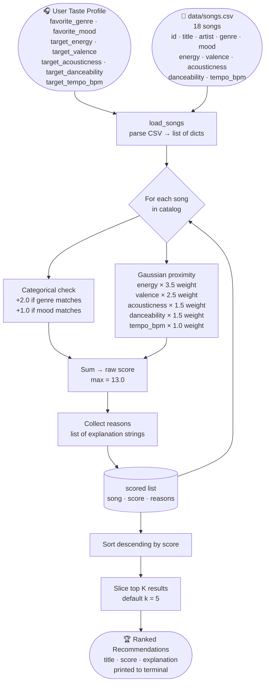

# 🎵 Music Recommender Simulation

## Project Summary

In this project you will build and explain a small music recommender system.

Your goal is to:

- Represent songs and a user "taste profile" as data
- Design a scoring rule that turns that data into recommendations
- Evaluate what your system gets right and wrong
- Reflect on how this mirrors real world AI recommenders

Replace this paragraph with your own summary of what your version does.

---

## Data Flow Diagram



---

## How The System Works

**Song Features:**
Each song in `data/songs.csv` is described by the following features:

| Feature | Type | Range | Meaning |
|---------|------|-------|---------|
| `genre` | categorical | text | Musical genre (lofi, rock, pop, jazz, etc.) |
| `mood` | categorical | text | Descriptive mood label (chill, intense, happy, etc.) |
| `energy` | numerical | 0.0–1.0 | Intensity level (0 = ambient, 1 = intense) |
| `valence` | numerical | 0.0–1.0 | Emotional positivity (0 = sad/moody, 1 = happy/uplifting) |
| `acousticness` | numerical | 0.0–1.0 | Organic vs. synthetic texture (0 = electronic, 1 = acoustic) |
| `danceability` | numerical | 0.0–1.0 | Rhythmic drive (0 = minimal, 1 = highly rhythmic) |
| `tempo_bpm` | numerical | 60–180 | Beats per minute |

**User Taste Profile:**
A user is represented as a dictionary with a target value for each feature:

```python
user_prefs = {
    "favorite_genre":      "lofi",   # categorical — genre bonus
    "favorite_mood":       "chill",  # categorical — mood bonus
    "target_energy":        0.40,    # calm background listening
    "target_valence":       0.55,    # slightly positive, not upbeat
    "target_acousticness":  0.70,    # warm, organic textures
    "target_danceability":  0.60,    # gentle groove
    "target_tempo_bpm":    80.0,     # slow-to-mid BPM
}
```

---

**Algorithm Recipe:**

For each song the system computes a score out of a maximum of **13.0 points**:

*Step 1 — Categorical bonuses (fixed points):*
- `+2.0` if the song's genre exactly matches `favorite_genre`
- `+1.0` if the song's mood exactly matches `favorite_mood`

*Step 2 — Gaussian proximity for each numerical feature:*

For each feature, similarity is calculated as:

```
similarity = exp( -( (song_value − target_value)² / (2 × σ²) ) )
```

This gives **1.0** for a perfect match and smoothly approaches **0** as the song drifts away. Each similarity is then multiplied by a weight:

| Feature | Weight | σ (spread) | Why this weight |
|---------|--------|-----------|-----------------|
| energy | **3.5** | 0.25 | Sets the overall vibe — wrong energy ruins the session |
| valence | **2.5** | 0.25 | Emotional tone is the second most personal dimension |
| acousticness | **1.5** | 0.30 | Texture preference; listeners are more forgiving here |
| danceability | **1.5** | 0.30 | Groove matters but has similar tolerance to acousticness |
| tempo_bpm | **1.0** | 30.0 | Broad tolerance needed — BPM spans 60–180 |

*Step 3 — Rank and select:*

All songs are sorted by score (descending). The top K are returned with a plain-language explanation of the reasons (e.g., "genre match, energy very close").

---

**Known Biases and Limitations:**

- **Genre lock-in:** The `+2.0` genre bonus is large enough that a mediocre genre match can outscore a nearly-perfect numerical match from another genre. A great ambient track might be passed over if the user prefers lofi, even though the two genres feel identical at slow tempos.
- **Mood label is coarse:** "Chill" is applied to lofi, jazz, and ambient songs alike. The mood bonus can fire on songs that feel very different in practice — valence and energy do a better job, but the label still carries weight.
- **Energy dominates:** At weight 3.5, energy alone accounts for 27% of the maximum score. A user who says they like calm music will almost never see a high-energy track recommended, even if its genre, mood, and danceability are perfect matches.
- **Cold catalog problem:** With only 18 songs, any genre not in the catalog (e.g., Latin, K-pop) simply cannot be recommended. The system cannot surface what it has never seen.
- **No listening history:** The profile is hand-coded, not learned. It reflects what a user *says* they want, not what they actually play repeatedly — these often differ.


---

## Getting Started

### Setup

1. Create a virtual environment (optional but recommended):

   ```bash
   python -m venv .venv
   source .venv/bin/activate      # Mac or Linux
   .venv\Scripts\activate         # Windows

2. Install dependencies

```bash
pip install -r requirements.txt
```

3. Run the app:

```bash
python -m src.main
```

### Running Tests

Run the starter tests with:

```bash
pytest
```

You can add more tests in `tests/test_recommender.py`.

---

## Experiments You Tried

Use this section to document the experiments you ran. For example:

- What happened when you changed the weight on genre from 2.0 to 0.5
- What happened when you added tempo or valence to the score
- How did your system behave for different types of users

---

## Limitations and Risks

Summarize some limitations of your recommender.

Examples:

- It only works on a tiny catalog
- It does not understand lyrics or language
- It might over favor one genre or mood

You will go deeper on this in your model card.

---

## Reflection

Read and complete `model_card.md`:

[**Model Card**](model_card.md)

Write 1 to 2 paragraphs here about what you learned:

- about how recommenders turn data into predictions
- about where bias or unfairness could show up in systems like this


---

## 7. `model_card_template.md`

Combines reflection and model card framing from the Module 3 guidance. :contentReference[oaicite:2]{index=2}  

```markdown
# 🎧 Model Card - Music Recommender Simulation

## 1. Model Name

Give your recommender a name, for example:

> VibeFinder 1.0

---

## 2. Intended Use

- What is this system trying to do
- Who is it for

Example:

> This model suggests 3 to 5 songs from a small catalog based on a user's preferred genre, mood, and energy level. It is for classroom exploration only, not for real users.

---

## 3. How It Works (Short Explanation)

Describe your scoring logic in plain language.

- What features of each song does it consider
- What information about the user does it use
- How does it turn those into a number

Try to avoid code in this section, treat it like an explanation to a non programmer.

---

## 4. Data

Describe your dataset.

- How many songs are in `data/songs.csv`
- Did you add or remove any songs
- What kinds of genres or moods are represented
- Whose taste does this data mostly reflect

---

## 5. Strengths

Where does your recommender work well

You can think about:
- Situations where the top results "felt right"
- Particular user profiles it served well
- Simplicity or transparency benefits

---

## 6. Limitations and Bias

Where does your recommender struggle

Some prompts:
- Does it ignore some genres or moods
- Does it treat all users as if they have the same taste shape
- Is it biased toward high energy or one genre by default
- How could this be unfair if used in a real product

---

## 7. Evaluation

How did you check your system

Examples:
- You tried multiple user profiles and wrote down whether the results matched your expectations
- You compared your simulation to what a real app like Spotify or YouTube tends to recommend
- You wrote tests for your scoring logic

You do not need a numeric metric, but if you used one, explain what it measures.

---

## 8. Future Work

If you had more time, how would you improve this recommender

Examples:

- Add support for multiple users and "group vibe" recommendations
- Balance diversity of songs instead of always picking the closest match
- Use more features, like tempo ranges or lyric themes

---

## 9. Personal Reflection

A few sentences about what you learned:

- What surprised you about how your system behaved
- How did building this change how you think about real music recommenders
- Where do you think human judgment still matters, even if the model seems "smart"

